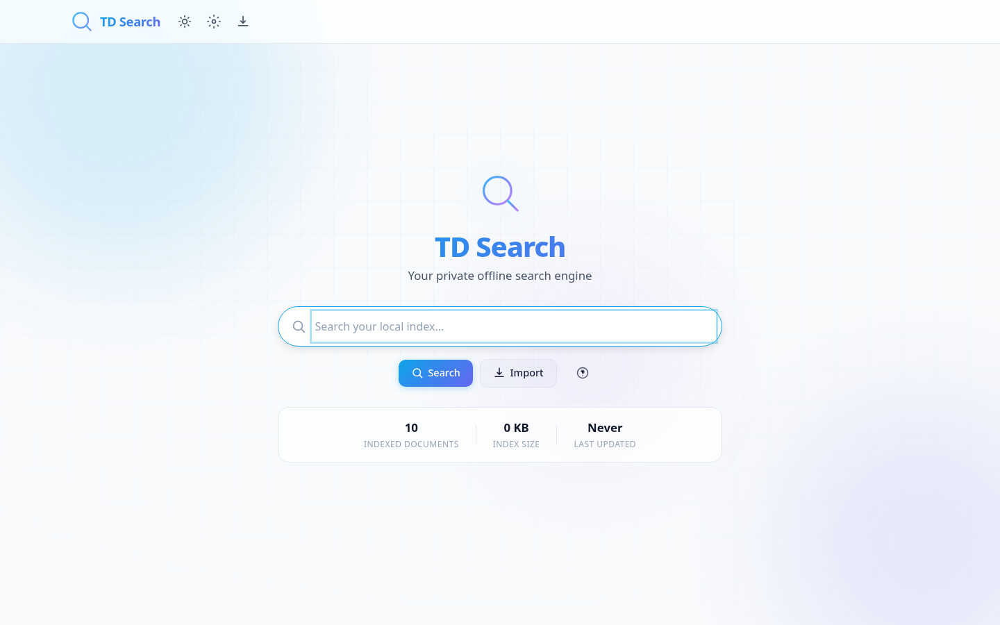
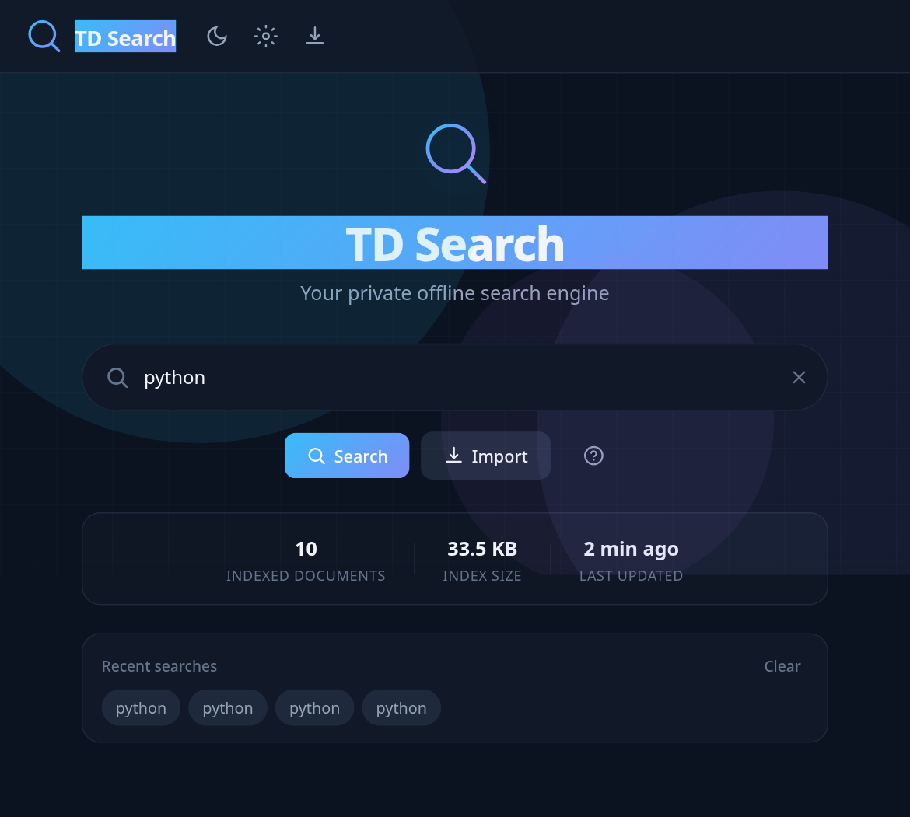

# TD Search

**A private search engine that runs in your browser.**  
Index your own files offline — or pull live web, images, videos, news, maps (SerpAPI) and AI answers (OpenRouter).


<p align="center">
  <b>Offline-first</b> · <b>No backend required for local search</b> · <b>Optional Google-quality web results</b>
</p>

---

## Why TD Search?

Most “search demos” are thin wrappers around Google. TD Search is different:

| | Typical demo | **TD Search** |
|---|---|---|
| Works offline | Rarely | **Yes** — open `index.html` and search |
| Your documents | Uploaded to a server | **Stay in your browser** (IndexedDB) |
| Real inverted index | Fake / filter list | **Yes** — tokenize, rank, highlight |
| Live web results | Hardcoded API calls | **Optional** via local SerpAPI proxy |
| Dependencies | React + 40 packages | **Zero** front-end dependencies |
| Privacy | Analytics, CDNs | **No tracking, no external assets** |

---

## Screenshots

<table>
  <tr>
    <td width="50%"><br/><sub>Home — light theme</sub></td>
    <td width="50%"><br/><sub>Home — dark theme</sub></td>
  
</table>

---

## Features

### Local search engine
- Import HTML via file picker or **drag-and-drop**
- Full **inverted index** (term → document IDs)
- Relevance ranking: title, headings, URL, body, exact phrases
- Operators: `"phrase"`, `title:`, `url:`, `site:`, `OR`, `AND`, `-term`, `-filetype:`
- Highlighted snippets, autocomplete, recent searches
- Export / import the entire index as JSON
- Built-in demo corpus (Python, JavaScript, HTML, CSS, Linux, Git, C++, Go, …)

### Online search (optional)
Powered by [SerpAPI](https://serpapi.com) through a **local Python proxy** (API keys never touch the frontend):

| Tab | Source | What you get |
|-----|--------|----------------|
| **All** | `google` | Organic results, answer box, knowledge graph, related searches |
| **Images** | `google_images` | Responsive image grid |
| **Videos** | `google_videos` | Video cards with thumbnail, channel, duration |
| **News** | `google_news` | News cards with source & date |
| **Maps** | `google_maps` | Places — address, rating, phone, map link |
| **AI** | [OpenRouter](https://openrouter.ai) | LLM answer (model selectable in Settings) |
| **Local** | Your index | Private documents only |

### Interface
- Light / dark / system theme
- Glassmorphism UI, polished empty & error states
- Keyboard-first: `Ctrl+K`, `/`, `Esc`, arrow autocomplete
- Mobile-friendly layout
- Debug panel (doc count, unique terms, query timing)

---

## Quick start

### 1. Local search only (30 seconds)

```bash
# No install. No build.
open index.html          # macOS
xdg-open index.html      # Linux
start index.html         # Windows
```

Or just double-click `index.html`.  
Search the demo data, or click **Import** and select your HTML files.

### 2. Live web / images / videos / news / maps / AI

SerpAPI and OpenRouter block browser CORS on purpose. Use the included proxy so **keys stay on your machine**:

```bash
cd offline-search-engine

python3 proxy_server.py \
  --key YOUR_SERPAPI_KEY \
  --openrouter YOUR_OPENROUTER_KEY
```

Open **http://127.0.0.1:8080** (not `file://`).

Then in the app:

1. **Settings** → enable **Online search** (All / Images / Videos / News / Maps)
2. **Settings** → enable **AI tab** + pick a model (OpenRouter)
3. Mode: `Online only` or `Local + Online`
4. **Test Proxy / API**
5. Search → tabs **All · Images · Videos · News · Maps · AI · Local**

```bash
# Alternatives
python3 proxy_server.py --key SERP_KEY --openrouter OR_KEY --port 3000
export SERPAPI_KEY=... OPENROUTER_API_KEY=...
python3 proxy_server.py
python3 launcher.py
```

Keys:
- SerpAPI → [serpapi.com/manage-api-key](https://serpapi.com/manage-api-key)
- OpenRouter → [openrouter.ai/keys](https://openrouter.ai/keys)

---

## Architecture

```
                     ┌──────────────────────────────────────┐
                     │            TD Search UI              │
                     │   index.html · app.js · style.css    │
                     └───────────┬──────────────┬───────────┘
                                 │              │
                    local only   │              │  online tabs
                                 ▼              ▼
                     ┌─────────────────┐  ┌──────────────────┐
                     │  search.js      │  │  online.js       │
                     │  indexer.js     │  │  → localhost     │
                     │  storage.js     │  └────────┬─────────┘
                     │  parser.js      │           │
                     │  crawler.js     │           ▼
                     └────────┬────────┘  ┌──────────────────┐
                              │           │ proxy_server.py  │
                              ▼           │  (Python stdlib) │
                     ┌─────────────────┐  └────────┬─────────┘
                     │   IndexedDB     │           │ HTTPS
                     │  documents +    │           ▼
                     │  inverted index │  ┌──────────────────┐
                     └─────────────────┘  │    SerpAPI       │
                                          │  Google results  │
                                          └──────────────────┘
```

**Local path:** HTML files → parser → inverted index → ranked results.  
**Online path:** query → local proxy → SerpAPI (web/images/videos/news/maps) or OpenRouter (AI).

---

## Project layout

```
offline-search-engine/
├── index.html              # Shell, modals, tabs
├── style.css               # Themes, layout, components
├── app.js                  # UI controller & wiring
├── search.js               # Query language + ranking
├── indexer.js              # Inverted index lifecycle
├── storage.js              # IndexedDB (+ localStorage fallback)
├── parser.js               # Safe HTML extraction (no script exec)
├── crawler.js              # Multi-file import, robots.txt helper
├── online.js               # SerpAPI client via proxy
├── data.js                 # Demo documents
├── proxy_server.py         # Static server + SerpAPI + OpenRouter proxy
├── screenshots/            # README images
└── README.md
```

---

## Local search deep-dive

### Indexing pipeline

1. **Import** — `FileReader` loads one or many `.html` / `.htm` files  
2. **Sanitize** — `<script>`, `<style>`, chrome/nav noise removed  
3. **Extract** — title, meta description, headings, body text, links  
4. **Tokenize** — lowercase, punctuation stripped, short tokens dropped  
5. **Post** — inverted index `term → [docIds]` + per-field token lists  
6. **Persist** — IndexedDB (`documents`, `inverted_index`, `metadata`, …)

### Ranking model

| Signal | Points | Notes |
|--------|-------:|-------|
| Title match | **+20** | Extra boost for repeated hits |
| Heading match | **+15** | h1–h6 |
| URL / path match | **+10** | Useful for `docs/`, filenames |
| Exact phrase | **+25** | `"machine learning"` |
| Body match | **+5** | Caps on repetition spam |
| Short focused docs | **+2** | Light tie-breaker |

Results sort by score; UI also supports newest / oldest / title.

### Query operators

```text
python                         # single term
"machine learning"             # exact phrase
title:javascript               # title field only
url:api                        # path / URL only
site:example.com               # URL contains
python OR rust                 # either
python AND tutorial            # both (AND is default)
python -java                   # exclude
-filetype:pdf                  # exclude extension
```

---

## Online search deep-dive

| Concern | How TD Search handles it |
|---------|---------------------------|
| CORS | Browser never calls SerpAPI or OpenRouter directly |
| API key exposure | Keys only exist in the `proxy_server.py` process |
| Network binding | Proxy listens on `127.0.0.1` by default |
| SerpAPI engines | `google`, `google_images`, `google_videos`, `google_news`, `google_maps` |
| AI | OpenRouter chat completions (`POST /api/ai`) |
| Defaults | `hl=fa`, `gl=ir` (change in `online.js`) |
| Default AI model | `openai/gpt-4o-mini` (change in Settings) |

Proxy endpoints:

```http
GET  /api/health
GET  /api/search?q=tea&engine=google&num=10
GET  /api/search?q=cats&engine=google_images&num=20
GET  /api/search?q=music&engine=google_videos
GET  /api/search?q=ai&engine=google_news
GET  /api/search?q=cafe+tehran&engine=google_maps
POST /api/ai
Content-Type: application/json
{ "q": "Explain quantum entanglement simply", "model": "openai/gpt-4o-mini" }
```

### AI tab models (examples)

Selectable in **Settings → AI Search**:

- `openai/gpt-4o-mini` (default, fast/cheap)
- `openai/gpt-4o`
- `anthropic/claude-3.5-sonnet`
- `google/gemini-flash-1.5`
- `meta-llama/llama-3.1-70b-instruct`

Any OpenRouter model id works if you set it via storage or extend the dropdown in `index.html`.

---

## Settings cheat-sheet

| Area | Options |
|------|---------|
| Theme | System · Dark · Light |
| Results per page | 10 · 20 · 50 |
| Matching | Highlight, exact phrase, fuzzy, title/content toggles |
| Online | Enable flag, Local / Online / Both (All, Images, Videos, News, Maps) |
| AI | Enable AI tab, OpenRouter model picker |
| Index | Export JSON, import JSON, rebuild, clear |
| Privacy | Local data stays in-browser; online/AI go only to your proxy → SerpAPI / OpenRouter |
| Developer | Debug panel — counts, terms, timings |

---

## Keyboard shortcuts

| Shortcut | Action |
|----------|--------|
| `Ctrl + K` / `⌘ K` | Focus search |
| `/` | Focus search (when not typing) |
| `Enter` | Run search |
| `↑` `↓` | Move in autocomplete |
| `Esc` | Close modal / dismiss autocomplete |

---

## Privacy & security

- **No analytics, no ads, no telemetry**
- **No Google Fonts / icon CDNs** for the core UI — inline SVG only  
- Imported HTML is **data**, never executed  
- Snippets are escaped before insert (XSS-aware rendering)  
- SerpAPI key belongs in the proxy process, not in `localStorage` for production use  
- If a key was ever pasted into the UI or a screenshot, **rotate it**

---

## Browser support & limits

| Mode | Requirement |
|------|-------------|
| Local search | Modern Chromium / Firefox / Safari |
| Large indexes | IndexedDB (auto-fallback to memory + `localStorage`) |
| Online tabs | Python 3 + `proxy_server.py` + localhost |

**`file://` realities**

- Fine for pure local search  
- Cannot call SerpAPI (CORS) — use the proxy and `http://127.0.0.1:8080`  
- Cannot recursively read folders — user selects files explicitly  

---

## Troubleshooting

| Symptom | Fix |
|---------|-----|
| `Failed to fetch` on online/AI search | Start proxy and open **http://127.0.0.1:8080** — `python3 proxy_server.py --key SERP --openrouter OR` |
| Proxy says no SerpAPI key | Pass `--key` or export `SERPAPI_KEY` |
| AI tab error / no OpenRouter key | Pass `--openrouter` or export `OPENROUTER_API_KEY`; enable AI in Settings |
| Maps/Videos empty | Confirm SerpAPI plan supports `google_maps` / `google_videos` for your key |
| No local hits | Import HTML, or stay on demo data; try the **Local** tab |
| Empty after refresh | Check IndexedDB isn’t blocked; try Export → Clear → Import |
| Wrong language snippets online | Edit `hl` / `gl` in `online.js` |
| Port already in use | `python3 proxy_server.py --key … --port 3000` |

---

## Extending TD Search

**Markdown / PDF text**  
Extend `parser.js` + accept more types in `crawler.js`.

**BM25 or TF-IDF**  
Swap the scorer inside `search.js`; keep the same result object shape.

**Directory crawler on a server**  
Walk disk with Python, emit the **Export Index** JSON schema, then **Import Index** in the UI.

**Custom proxy auth / rate limits**  
`proxy_server.py` is plain stdlib HTTP — easy to harden.

**Change online defaults**

```js
// online.js
hl: options.lang || 'en',
gl: options.country || 'us',
```

---

## Tech stack

| Layer | Choice |
|-------|--------|
| UI | Semantic HTML, modern CSS (no framework) |
| Logic | Vanilla ES modules-style scripts |
| Persistence | IndexedDB + localStorage fallback |
| Parsing | `DOMParser`, `FileReader` |
| Online bridge | Python 3 **stdlib only** (`http.server`, `urllib`) |
| Live web results | SerpAPI (web, images, videos, news, maps) |
| AI answers | OpenRouter |

No npm. No bundler. No CDN runtime dependency for core search.

---

## License

Free for personal and commercial use.  
Provided as-is, without warranty.  
You are responsible for SerpAPI quotas, terms, and key hygiene.

---

<p align="center">
  <b>TD Search</b> — your index, your machine, your rules.
</p>
